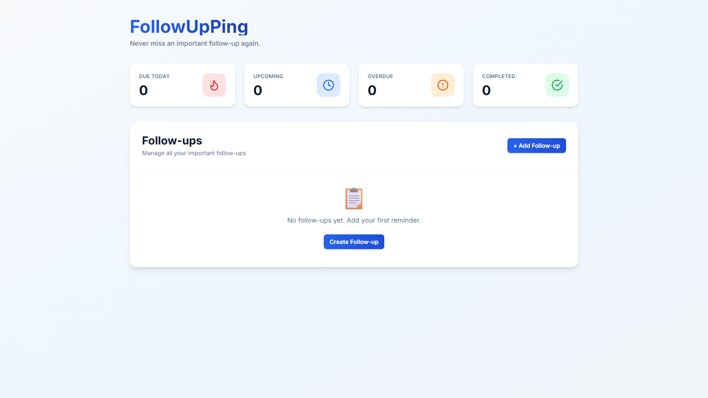
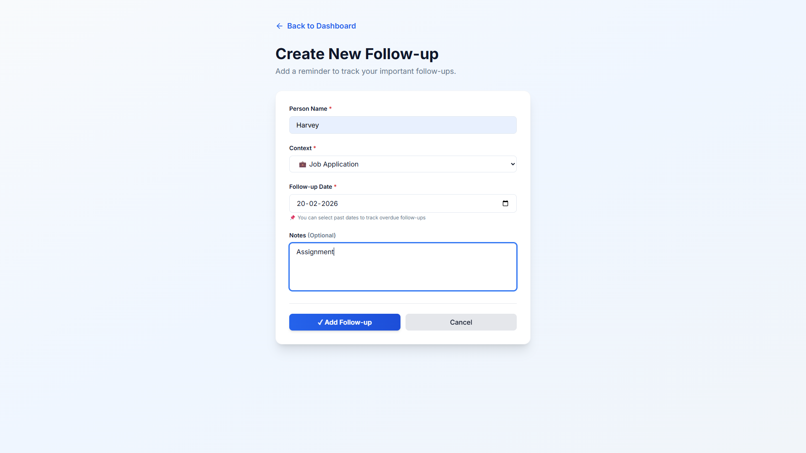
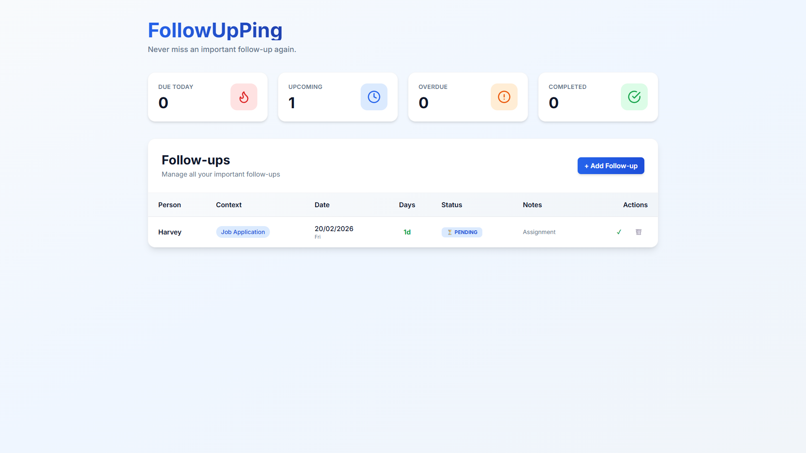
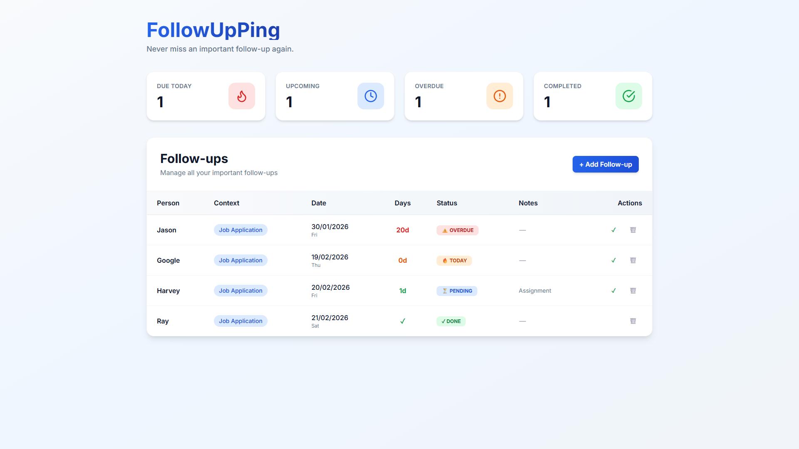

# FollowUpPing - Full-Stack Follow-Up Reminder Dashboard

**Build in 48 hours | Python + Flask + React | Full Source Included**

## What is FollowUpPing?

A lightweight, full-stack web application for tracking important follow-ups and never missing deadlines. Perfect for job seekers, freelancers, and startup founders who need to manage their follow-ups efficiently.

**Live Concept:** You apply for a job → Add it to FollowUpPing → Get reminded to follow up → Track status → Stay organized.

---

## ⚡ Quick Start (5 minutes)

### Prerequisites
- Python 3.8+
- Node.js 14+
- Git

### Setup Instructions

**Terminal 1: Backend**
```bash
cd backend
python -m venv venv
venv\Scripts\activate        # Windows
# or: source venv/bin/activate  # Mac/Linux
pip install -r requirements.txt
python app.py
```
✅ Backend runs at: `http://localhost:5000`

**Terminal 2: Frontend**
```bash
cd frontend
npm install
npm run dev
```
✅ Frontend runs at: `http://localhost:5174`

**Open browser:** http://localhost:5174 and start using the app!

---

## 🎥 Working Demo Video

<video width="600" controls>
  <source src="./assets/Working-video.mp4" type="video/mp4">
  Your browser does not support the video tag.
</video>

---

## 📸 Screenshots

### Dashboard Overview


### Add Follow-Up Form  


### Edit Follow-Up


### Follow-Up Management


## 🏗️ How Data Flows (Simple Explanation)

### User's Perspective
```
1. User clicks "Add Follow-Up"
2. Fills in: Person Name, Context, Follow-up Date, Notes
3. Clicks "Save"
4. Data sent to backend → Stored in database
5. Dashboard automatically updates with new follow-up
6. User marks as "Completed" when done
7. Completed items appear in green on dashboard
```

### Behind the Scenes
```
Frontend (React) 
   ↓ (sends JSON)
API Endpoint (Flask)
   ↓ (validates & saves)
Database (SQLite)
   ↓ (retrieves data)
Frontend (displays results)
```

### Database Structure (Simple)
```
FollowUps Table
├── id (unique number)
├── person_name (who to follow up with)
├── context (what it was about)
├── follow_up_date (when to follow up)
├── notes (additional details)
├── status (pending or completed)
├── created_at (when added)
└── updated_at (last updated)
```

---

## 🎯 Key Features

✅ **Dashboard Overview**
- Quick stats: Due Today, Upcoming, Overdue, Completed
- Color-coded follow-ups for quick scanning
- Real-time updates

✅ **Follow-up Management**
- Create new follow-ups in 30 seconds
- Edit follow-up details anytime
- Mark as completed with one click
- Delete with confirmation popup

✅ **Smart Tracking**
- Auto-calculates days until follow-up
- Highlights overdue items in red
- Shows "flame" icon for today's follow-ups
- Color-coded status (blue=pending, green=completed)

✅ **Clean, Modern UI**
- Responsive design (works on phone, tablet, desktop)
- Smooth animations and transitions
- Professional SaaS-style interface
- Intuitive navigation

---

## 🛠️ Technical Stack & Decisions

### Why These Technologies?

| Component | Technology | Why |
|-----------|-----------|-----|
| **Backend** | Python + Flask | Fast prototyping, excellent for REST APIs, large ecosystem |
| **Frontend** | React + Vite | Modern component-based UI, hot reload for development, fast builds |
| **Database** | SQLite | Perfect for single-user app, no external dependencies, auto-initializes |
| **Styling** | Tailwind CSS | Rapid UI development, consistency, responsive by default |
| **Icons** | Lucide React | Modern, lightweight icon library |

### Database Schema

```python
class FollowUp(db.Model):
    id = db.Column(db.Integer, primary_key=True)
    person_name = db.Column(db.String(100), nullable=False)
    context = db.Column(db.String(500), nullable=False)
    follow_up_date = db.Column(db.DateTime, nullable=False)
    notes = db.Column(db.Text)
    status = db.Column(db.Enum('pending', 'completed'), default='pending')
    created_at = db.Column(db.DateTime, default=datetime.utcnow)
    updated_at = db.Column(db.DateTime, default=datetime.utcnow)
```

**Key Decision:** SQLite with auto-initialization means:
- ✅ Zero database setup required
- ✅ Data persists between sessions
- ✅ Portable (single file)
- ✅ Perfect for MVP/assignment

---

## 📁 Project Structure

```
FollowUpPing/
│
├── backend/
│   ├── app.py              # Main Flask app (routes & factory)
│   ├── models.py           # Database models (FollowUp)
│   ├── routes.py           # API endpoints (/api/followups)
│   ├── database.py         # Database initialization & session
│   ├── config.py           # Config for dev/test/prod
│   ├── requirements.txt    # Python dependencies
│   └── .env.example        # Environment variables template
│
├── frontend/
│   ├── src/
│   │   ├── main.jsx        # React entry point
│   │   ├── App.jsx         # Root component & routing
│   │   ├── index.css       # Global styles
│   │   ├── pages/
│   │   │   ├── DashboardPage.jsx    # Main dashboard with stats
│   │   │   └── AddFollowUpPage.jsx  # Create/edit form
│   │   ├── components/
│   │   │   └── index.jsx       # Reusable UI components
│   │   └── api/
│   │       └── client.js   # Backend API communication
│   ├── index.html          # HTML template
│   ├── vite.config.js      # Vite configuration
│   ├── tailwind.config.js  # Tailwind CSS setup
│   ├── package.json        # Node dependencies
│   └── .env.example        # Frontend env variables
│
├── README.md               # This file
├── claude.md               # AI usage, prompts & coding standards
├── LICENSE                 # MIT License
├── .gitignore             # Git ignore rules
└── followups.db           # SQLite database (auto-generated)
```

---

## 🔌 API Endpoints

All endpoints return JSON. Base URL: `http://localhost:5000/api`

### Get All Follow-Ups
```http
GET /followups
Response: [
  {
    "id": 1,
    "person_name": "John Smith",
    "context": "React Engineer Position",
    "follow_up_date": "2024-02-25T10:00:00",
    "notes": "Follow up if no response",
    "status": "pending",
    "created_at": "2024-02-19T15:30:00"
  }
]
```

### Create Follow-Up
```http
POST /followups
Content-Type: application/json

{
  "person_name": "John Smith",
  "context": "React Engineer Position",
  "follow_up_date": "2024-02-25T10:00:00",
  "notes": "Follow up if no response"
}
Response: 201 Created + follow-up object
```

### Update Follow-Up Status
```http
PUT /followups/1
Content-Type: application/json

{
  "status": "completed"
}
Response: 200 OK + updated follow-up object
```

### Delete Follow-Up
```http
DELETE /followups/1
Response: 204 No Content
```

---

## 🤖 AI Usage & Transparency

### How AI Was Used
- **Code Structure:** Generated boilerplate Flask and React structure
- **Database Schema:** Designed SQLAlchemy models
- **API Endpoints:** Scaffolded RESTful endpoints
- **Components:** Created React component templates
- **Configuration:** Set up Vite, Tailwind, Flask configs

### What Was Manual/Verified
- ✅ All business logic and feature implementation
- ✅ Testing of every endpoint and component
- ✅ UI/UX polish and refinements
- ✅ Bug fixes and debugging
- ✅ Documentation and code comments
- ✅ Integration between frontend and backend

### Prompts Used
See [claude.md](claude.md) for detailed prompts, constraints, and coding standards applied throughout development.

---

## 🧪 Testing the Application

### Quick Smoke Test
1. **Create a follow-up:** John Doe, "Interview", Feb 25, 2024
2. **Verify dashboard updates** with new stats
3. **Edit the follow-up:** Change notes
4. **Mark as completed:** Should turn green
5. **Delete a follow-up:** Should disappear from dashboard

### API Testing (using curl)
```bash
# Create
curl -X POST http://localhost:5000/api/followups \
  -H "Content-Type: application/json" \
  -d '{"person_name":"Test","context":"Test","follow_up_date":"2024-02-25T10:00:00"}'

# Get All
curl http://localhost:5000/api/followups

# Update Status
curl -X PUT http://localhost:5000/api/followups/1 \
  -H "Content-Type: application/json" \
  -d '{"status":"completed"}'

# Delete
curl -X DELETE http://localhost:5000/api/followups/1
```

---

## 🚀 Extension Ideas

### Short-term (Easy to Add)
- **Email Reminders:** Send email notification when follow-up date arrives
- **Categories:** Tag follow-ups (job, freelance, startup, etc.)
- **Search/Filter:** Filter by status, date range, or person
- **Export:** Download follow-ups as CSV

### Medium-term
- **User Authentication:** Sign up, log in, save to personal account
- **Recurring Reminders:** Set up repeating follow-ups
- **Team Collaboration:** Share follow-ups with team members
- **Calendar Integration:** View follow-ups in calendar view

### Long-term Strategic
- **Mobile App:** React Native version
- **Analytics Dashboard:** Charts and insights on follow-up completion rate
- **AI Suggestions:** Auto-suggest follow-up dates based on context
- **Integrations:** Connect with Gmail, Outlook, Slack

---

## 🔒 Security Notes

- ✅ All inputs validated on backend before storage
- ✅ CORS properly configured for frontend-only access
- ✅ No sensitive data exposed in error messages
- ✅ Database auto-initialized (no manual SQL needed)
- ✅ Environment variables in .env files (not committed)

---

## 🌟 Key Decision Highlights

### Why SQLite over PostgreSQL?
- **Assignment Requirement:** "Any relational database"
- **Benefit:** Zero external dependencies, auto-setup, portable
- **Trade-off:** Single-user only (perfect for assignment scope)

### Why Vite over Create React App?
- **Speed:** 10x faster development experience
- **Modern:** Uses ES modules natively
- **Config:** Minimal configuration needed

### Why Tailwind over Bootstrap?
- **Development Speed:** Utility-first approach
- **Customization:** Easy to extend without writing CSS
- **Bundle Size:** Only includes used utilities

---

## 📝 Environment Setup

### Backend (.env)
```env
FLASK_ENV=development
FLASK_DEBUG=True
DATABASE_URL=sqlite:///followups.db
```

### Frontend (.env)
```env
VITE_API_URL=http://localhost:5000
```

---

## 🎓 What This Assignment Demonstrates

✅ **Full-Stack Development:** Backend + Frontend + Database in 48 hours
✅ **Modern Stack:** Flask, React, SQLite with best practices
✅ **Clean Code:** Modular structure, proper separation of concerns
✅ **User Experience:** Responsive design, intuitive interface
✅ **API Design:** RESTful endpoints with proper status codes
✅ **Database Design:** Normalized schema with proper validation
✅ **AI Collaboration:** Smart use of AI tools with manual verification
✅ **Documentation:** Clear code, inline comments, detailed README

---

## 📞 Support

For questions about the codebase:
1. Check [claude.md](claude.md) for AI usage and architecture
2. Review code comments in Flask routes and React components
3. API documentation above shows all endpoints
4. Database schema clearly defined in models.py

---

**Built during a 48-hour technical assessment | Better Software - Associate Software Engineering Role**

*Last Updated: February 19, 2026*
